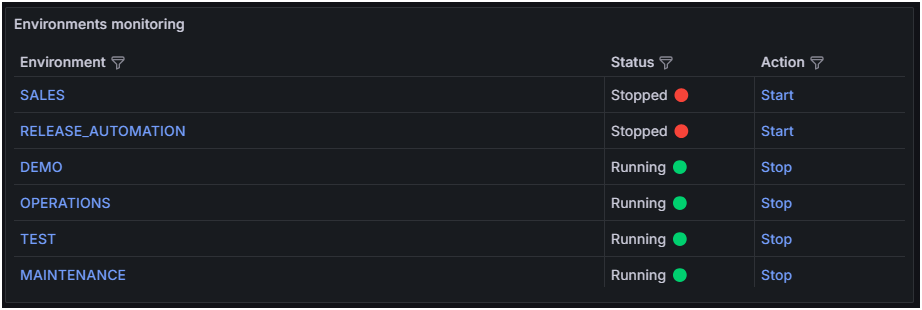
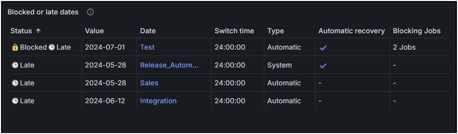
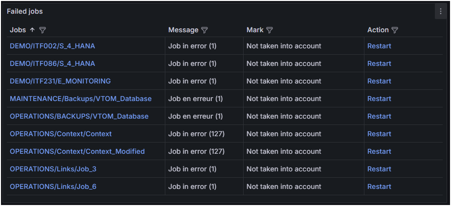
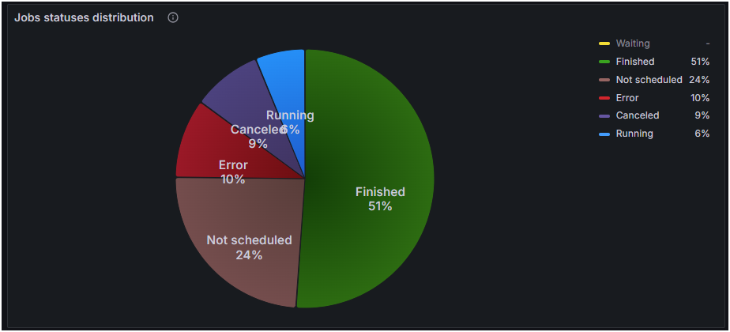

# Nom du projet
&nbsp;
  

# Disclaimer
Aucun support ni garanties ne seront fournis par Absyss SAS pour ce projet et fichiers associés. L'utilisation est à vos propres risques.

Absyss SAS ne peut être tenu responsable des dommages causés par l'utilisation d'un des fichiers mis à disposition dans ce dépôt Github.

Il est possible de faire appel à des jours de consulting pour l'implémentation.

# Prérequis

    * Visual TOM (testé avec la version 7.1.2)
    * Port de base de données Visual TOM accessible depuis Grafana
    * Grafana (testé avec la version 11.0.0)

# Instructions

    * Créez une source de données connectée à la base de données PostgreSQL Visual TOM dans Grafana
    * Importez les tableaux de bord dans Grafana
        * Mettez à jour la source de données
        * Mettez à jour les variables dans le tableau de bord *Visual TOM Monitoring*
    * Importez le bundle GRAFANA.xbdle dans le Self Service de User Portal
        * Mettez à jour la source de données dans le bundle    

## Visual TOM License monitoring
Ce tableau de bord contient plusieurs panneaux liés aux licences Visual TOM (agent, traitement ou exécutions).  
Selon votre type de licence, vous pouvez désactiver/supprimer les panneaux non souhaités.  

### Avg daily executions for current year
Ce panneau affiche le nombre moyen d'exécutions quotidiennes pour l'année en cours.  
Les seuils sont basés sur la licence :
    * 70% - Orange
    * 90% - Rouge

### Number of Jobs
Ce panneau affiche le nombre de Traitement existants dans la base de données
Les seuils sont basés sur la licence :
    * 70% - Orange
    * 90% - Rouge

### Number of Agents
Ce panneau affiche le nombre d'agents (en cours d'exécution et uniques)
Les seuils sont basés sur la licence :
    * 70% - Orange
    * 90% - Rouge

### License Expiration
Ce panneau affiche le nombre de jours restants avec une couleur spécifique en fonction de la valeur.  
Plus de 100 jours  
  
Entre 31 et 99 jours  
  
30 jours ou moins  
  

### Daily average executions (Last 30 days)
Ce panneau affiche le nombre d'exécutions pour les 30 derniers jours.  
La ligne rouge affiche le nombre d'exécutions autorisées par la licence.  

### Trend of executions (current year)
Ce panneau affiche 4 séries pour l'année en cours :
    * Nombre d'exécutions autorisées par la licence
    * Consommations réelles d'exécution jusqu'à aujourd'hui
    * Tendance des exécutions basée sur le nombre d'exécutions quotidiennes depuis le 1er janvier
    * Tendance des exécutions basée sur le nombre d'exécutions quotidiennes des 30 derniers jours

## Visual TOM monitoring
Ce tableau de bord contient plusieurs panneaux liés à la surveillance Visual TOM (agents, Traitements, environnements...).  
En haut à gauche du tableau de bord, 2 champs permettent de filtrer par environnement et/ou application. Ces filtres s'appliquent à la plupart des panneaux.  
  
Un lien direct vers l'interface web Visual TOM XVision est également disponible en haut à droite du tableau de bord.

### Agents monitoring
Ce panneau affiche la liste de tous les agents avec leur nom d'hôte, leur statut et leur statut de gestionnaire.  
:information_source:En cliquant sur le nom de l'agent, un nouvel onglet s'ouvre sur Visual TOM XVision avec l'agent directement sélectionné.

### Environments monitoring
Ce panneau affiche la liste de tous les environnements avec le statut de leur moteur et une action.  
:information_source:En cliquant sur le nom de l'environnement, un nouvel onglet s'ouvre sur Visual TOM XVision avec l'environnement directement sélectionné.

L'action permet d'arrêter ou de démarrer le moteur directement depuis Grafana (:warning: nécessite User Portal avec le Self Service).

### Blocked or late dates monitoring
Ce panneau affiche la liste de toutes les dates en retard et/ou bloquées.  
Pour chaque date, le panneau affiche plusieurs colonnes d'informations.  
:information_source:En cliquant sur le nom de la date, un nouvel onglet s'ouvre sur Visual TOM XVision avec la date directement sélectionnée.  
Une date est considérée comme en retard si la valeur n'est pas aujourd'hui et que l'heure minimum de bascule est atteinte.

### Number of errors per day
Ce panneau affiche un graphique pour les 30 derniers jours avec le nombre d'erreurs par jour.  
La ligne pointillée rouge montre le nombre moyen d'erreurs pour la même plage.  
:information_source:En cliquant sur une barre, un nouvel onglet s'ouvre sur Visual TOM XVision avec l'historique des exécutions du Traitement filtré sur le jour sélectionné.

### Failed jobs
Ce panneau affiche la liste de tous les Traitements en erreur avec quelques informations et une action.  
:information_source:En cliquant sur le nom du Traitement, vous avez 2 actions disponibles :
    * un nouvel onglet s'ouvre sur Visual TOM XVision dans le graphique de l'application avec le Traitement directement sélectionnée
    * un nouvel onglet s'ouvre sur Splunk avec un filtre sur le Traitement

L'action permet de *forcer à à venir* le Traitement directement depuis Grafana (:warning: nécessite le Portail Utilisateur avec le libre-service). Cette action nécessite de maîtriser l'impact potentiel sur l'ordonnancement.

### Jobs statuses distribution
Ce panneau affiche un diagramme avec la répartition de tous les Traitements par statut.  
:information_source:En cliquant sur l'un des statuts, un nouvel onglet s'ouvre sur Visual TOM XVision dans le *Suivi des Traitements* filtré sur le statut.  

# Licence
Ce projet est sous licence Apache 2.0. Voir le fichier [LICENCE](license) pour plus de détails.

# Code de conduite
  
Absyss SAS a adopté le [Contributor Covenant](CODE_OF_CONDUCT.md) en tant que Code de Conduite et s'attend à ce que les participants au projet y adhère également. Merci de lire [document complet](CODE_OF_CONDUCT.md) pour comprendre les actions qui seront ou ne seront pas tolérées.
