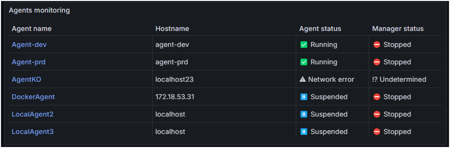
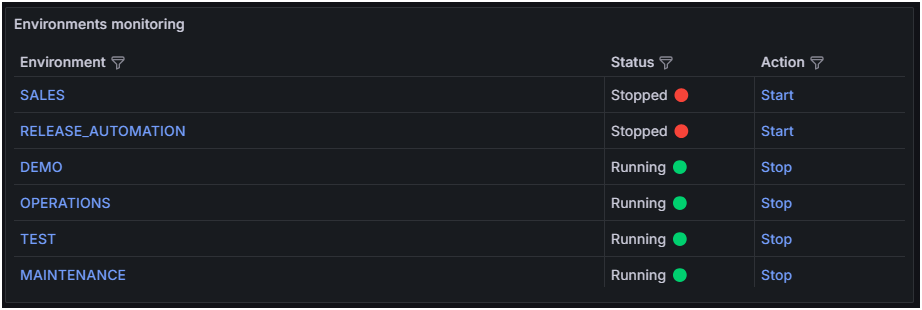
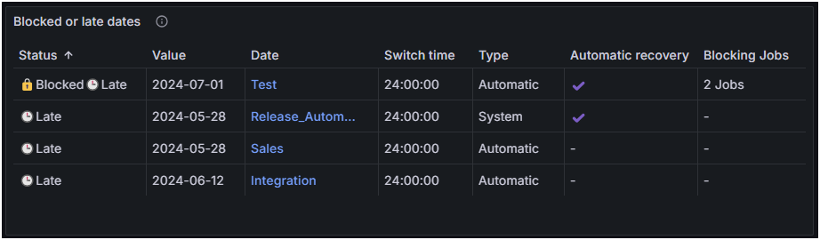
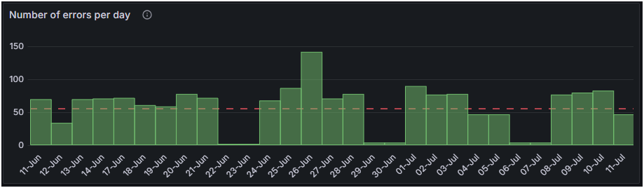
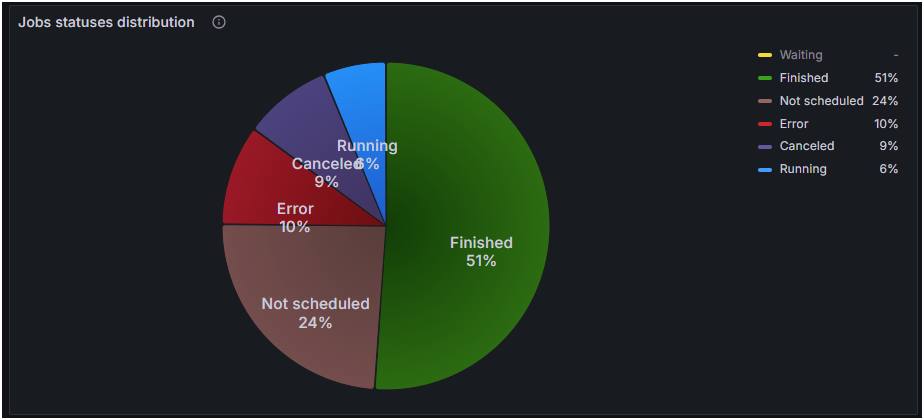

# Grafana
&nbsp;
  

# Disclaimer
No Support and No Warranty are provided by Absyss SAS for this project and related material. The use of this project's files is at your own risk.

Absyss SAS assumes no liability for damage caused by the usage of any of the files offered here via this Github repository.

Consultings days can be requested to help for the implementation.

# Prerequisites

  * Visual TOM (tested with version 7.1.2)
  * Visual TOM database port accessible from Grafana
  * Grafana (tested with version 11.0.0)

# Instructions

  * Create a datasource connected to Visual TOM PostgreSQL database in Grafana
  * Import the dashboards in Grafana
    * Update the datasource
    * Update the variables in the dashboard *Visual TOM Monitoring*
  * Import the bundle GRAFANA.xbdle into User Portal
    * Update the datasource in the bundle  

## Visual TOM License monitoring
This dashboard contains several panels related to Visual TOM licenses (agent, job or executions).  
Depending on your type of license, you can disable/remove the unwanted panels.  

### Avg daily executions for current year
This panel displays the average number of daily executions for current year.  
Thresholds are based on the license:
  * 70% - Orange
  * 90% - Red

### Number of Jobs
This panel displays the number of Jobs existing in the database
Thresholds are based on the license:
  * 70% - Orange
  * 90% - Red

### Number of Agents
This panel displays the number of Agents (running and unique)
Thresholds are based on the license:
  * 70% - Orange
  * 90% - Red

### License Expiration
This panel displays the number of days left with a specific color depending on the value.  
More than 100 days  
  
Between 31 to 99 days  
  
Less than or equal 30 days  
  

### Daily average executions (Last 30 days)
This panel displays the number of executions for the last 30 days.  
The red line displays the licensed number of executions.  

### Trend of executions (current year)
This panel displays 4 series for the current year:
  * Number of executions allowed in the license
  * Actual consumptions of execution until current day
  * Trend of executions based on number of daily executions since 1st of January
  * Trend of executions based on number of daily executions for last 30 days

## Visual TOM monitoring
This dashboard contains several panels related to Visual TOM monitoring (Agents, Jobs, Environments...).  
On the top left of the dashboard, 2 fields allow to filter on Environment and/or Application. These filters apply on most of the panels.  
  
A direct link to Visual TOM XVision web interface is also available in the top right of the dashboard.

### Agents monitoring
This panel displays the list of all Agents with their hostname, status and manager status.  
:information_source:When clicking on the Agent's name, a new tab is opened on Visual TOM XVision with the Agent directly selected.

### Environments monitoring
This panel displays the list of all Environments with the status of their engine and an action.  
:information_source:When clicking on the Environment's name, a new tab is opened on Visual TOM XVision with the Environment directly selected.

The action allows to stop or start the Engine directly from Grafana (:warning: requires User Portal with Self Service).

### Blocked or late dates monitoring
This panel displays the list of all Dates which are late and/or blocked.  
For each date, the panel shows several columns of information.  
:information_source:When clicking on the Date's name, a new tab is opened on Visual TOM XVision with the Date directly selected.  
A date is considered Late if the value is not today and minimum switch time is reached.

### Number of errors per day
This panel displays a bar graph for the last 30 days with the number of errors per day.  
The red dotted line show the average number of failures for the same time range.  
:information_source:When clicking on a bar, a new tab is opened on Visual TOM XVision with the Job executions history filtered on the selected day.

### Failed jobs
This panel displays the list of all failed jobs with some information and an action.  
:information_source:When clicking on the Job's name, you have 2 actions available:
  * a new tab is opened on Visual TOM XVision in the graph of the Application with the Job directly selected
  * a new tab is opened on Splunk with a filter on the Job

The action allows to *force to waiting* the job directly from Grafana (:warning: requires User Portal with Self Service). This action requires to know its impact on the scheduling.

### Jobs statuses distribution
This panel displays a pie chart with the distribution of all Jobs per status.  
:information_source:When clicking on one of the status, a new tab is opened on Visual TOM XVision in the *Jobs monitoring* filtered on the status.  

# License
This project is licensed under the Apache 2.0 License - see the [LICENSE](license) file for details

# Code of Conduct
  
Absyss SAS has adopted the [Contributor Covenant](CODE_OF_CONDUCT.md) as its Code of Conduct, and we expect project participants to adhere to it. Please read the [full text](CODE_OF_CONDUCT.md) so that you can understand what actions will and will not be tolerated.
